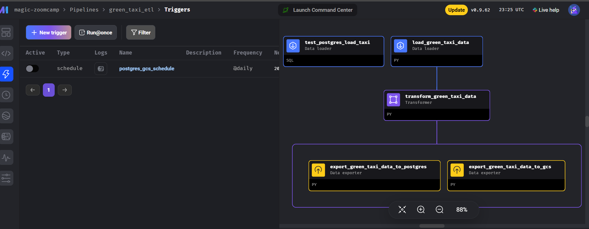

# ETL & Data Orchestration With Mage


**The goal is to construct an ETL pipeline that loads the data, performs some transformations, and writes the data to a database (and Google Cloud!).**

1. Now lets create a batch new pipeline and name it green_taxi_etl
1. I'll be working with the green taxi dataset
1. Lets add a data loader block and use Pandas to read data for the final quarter of 2020 (months 10, 11, 12)


```

DATA LOADER

import io
import pandas as pd
import requests

if 'data_loader' not in globals():
    from mage_ai.data_preparation.decorators import data_loader
if 'test' not in globals():
    from mage_ai.data_preparation.decorators import test

@data_loader
def load_data_from_api(*args, **kwargs):
    """
    Template for loading data from API
    """
    urls = [
        'https://github.com/DataTalksClub/nyc-tlc-data/releases/download/green/green_tripdata_2020-10.csv.gz',
        'https://github.com/DataTalksClub/nyc-tlc-data/releases/download/green/green_tripdata_2020-11.csv.gz',
        'https://github.com/DataTalksClub/nyc-tlc-data/releases/download/green/green_tripdata_2020-12.csv.gz'
    ]

    # Define the data types for each column
    taxi_dtypes = {
        'VendorID': pd.Int64Dtype(),
        'store_and_fwd_flag': str,
        'RatecodeID': pd.Int64Dtype(),
        'PULocationID': pd.Int64Dtype(),  
        'DOLocationID': pd.Int64Dtype(),
        'passenger_count': pd.Int64Dtype(),
        'trip_distance': float,
        'fare_amount': float,
        'extra': float,
        'mta_tax': float,
        'tip_amount': float,
        'tolls_amount': float,
        'improvement_surcharge': float,
        'total_amount': float,
        'payment_type': pd.Int64Dtype(),
        'trip_type': pd.Int64Dtype(),
        'congestion_surcharge': float
    }

    parse_dates = ['lpep_pickup_datetime', 'lpep_dropoff_datetime']

    # Initialize an empty DataFrame to hold the combined data
    df_combine = pd.DataFrame()

    for url in urls: 
        filepath = url
        df = pd.read_csv(filepath, sep=",", compression="gzip", dtype=taxi_dtypes, parse_dates=parse_dates)
        
        df_combine = pd.concat([df_combine, df], ignore_index=True)

    return df_combine

@test
def test_output(output, *args) -> None:
    """
    Template code for testing the output of the block.
    """
    assert output is not None, 'The output is undefined'

```


**Lets add a data transformer block.**
What i will be doing in the transformer block are:

1. Remove rows where the passenger count is equal to 0 or the trip distance is equal to zero.
1. Create a new column lpep_pickup_date by converting lpep_pickup_datetime to a date.
1. Rename columns in Camel Case to Snake Case, e.g. VendorID to vendor_id.
1. Add three assertions:
- vendor_id is one of the existing values in the column (currently)
- passenger_count is greater than 0
- trip_distance is greater than 0


```

 TRANSFORMER

if 'transformer' not in globals():
    from mage_ai.data_preparation.decorators import transformer
if 'test' not in globals():
    from mage_ai.data_preparation.decorators import test


@transformer
def transform(data, *args, **kwargs):

# Step  1: Remove rows where passenger count is  0 or trip distance is  0
    data = data[(data['passenger_count'] !=  0) & (data['trip_distance'] !=  0)] 

# Step  2: Create a new column lpep_pickup_date by converting lpep_pickup_datetime to a date
    data['lpep_pickup_date'] = data['lpep_pickup_datetime'].dt.date

# Step  3: Rename columns in CamelCase to snake_case
    data.rename(columns=lambda x: x.lower().replace(" ", "_"), inplace=True)

    return data


@test
def test_output(output, *args) -> None:
    """
    Template code for testing the output of the block.
    """
    assert (output['passenger_count'] >   0).all(), "passenger_count is not greater than   0"
    assert (output['trip_distance'] >   0).all(), "trip_distance is not greater than   0"
    assert 'vendorid' in output.columns, 'There are not vendor_id column'

```

**1. I will add 2 export block, this is what the block is suppose to do:**

- It will use a Postgres data exporter (SQL or Python), then write the dataset to a table called green_taxi in a schema mage. Replace the table if it already exists.


```
POSTGRES DATA EXPORTER

from mage_ai.settings.repo import get_repo_path
from mage_ai.io.config import ConfigFileLoader
from mage_ai.io.postgres import Postgres
from pandas import DataFrame
from os import path

if 'data_exporter' not in globals():
    from mage_ai.data_preparation.decorators import data_exporter

@data_exporter
def export_data_to_postgres(df: DataFrame, **kwargs) -> None:
    """
    Template for exporting data to a PostgreSQL database.
    Specify your configuration settings in 'io_config.yaml'.

    Docs: https://docs.mage.ai/design/data-loading#postgresql
    """
    schema_name = 'ny_taxi'  # Specify the name of the schema to export data to
    table_name = 'green_cab_data'  # Specify the name of the table to export data to
    config_path = path.join(get_repo_path(), 'io_config.yaml')
    config_profile = 'dev'

    with Postgres.with_config(ConfigFileLoader(config_path, config_profile)) as loader:
        loader.export(
            df,
            schema_name,
            table_name,
            index=False,  # Specifies whether to include index in exported table
            if_exists='replace',  # Specify resolution policy if table name already exists
        )

```

**- I will also write the data as Parquet files to a bucket in GCP, partioned by lpep_pickup_date. Using the pyarrow library to achieve this.**


``` 
GCS DATA EXPORTER

import pyarrow as pa
import pyarrow.parquet as pq
import os

if 'data_exporter' not in globals():
    from mage_ai.data_preparation.decorators import data_exporter

os.environ['GOOGLE_APPLICATION_CREDENTIALS'] = "/home/src/ultimate-aspect-410714-42e5b7775bcc.json"

bucket_name = 'mage_zoomcamp-etido-1'
project_id  = 'ultimate-aspect-410714'

table_name = "nyc_green_taxi_data.parquet"

root_path = f'{bucket_name}/{table_name}'

@data_exporter
def export_data(data, *args, **kwargs):
    data['lpep_pickup_date'] = data['lpep_pickup_datetime'].dt.date

    table = pa.Table.from_pandas(data)

    gcs = pa.fs.GcsFileSystem()

    pq.write_to_dataset(
        table,
        root_path=root_path,
        partition_cols=['lpep_pickup_date'],
        filesystem=gcs
    )

   ```




